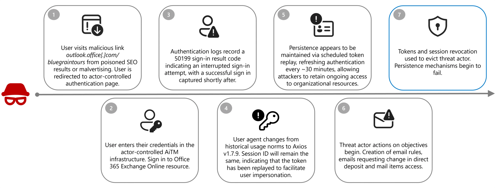

# Lab 1 — Cyber Threat Intelligence (CTI) Report Mapping to MITRE ATT&CK

## 1. Group Members

- Daniel Lonkry - 322303736

## 2. Source CTI Report

- **Title:** Investigating Storm-2755: "Payroll pirate" attacks targeting Canadian employees
- **Publisher:** Microsoft Threat Intelligence
- **Date:** 2026-04-09
- **Link:** [Link for the article](https://www.microsoft.com/en-us/security/blog/2026/04/09/investigating-storm-2755-payroll-pirate-attacks-targeting-canadian-employees/)

## 3. Short Attack Summary

Microsoft Threat Intelligence found a financially motivated group called **Storm-2755** targeting employees in Canada to steal their salary. Victims were sent to fake Office 365 login pages through **SEO poisoning and malvertising**, so the attack started the moment a user clicked what looked like a normal search result. The fake page was actually an **AiTM (adversary-in-the-middle) proxy** that captured both the password and the valid session token, which let the attackers skip MFA completely. After login, the attackers replayed the stolen token using an **Axios v1.7.9** HTTP client and kept the session alive by refreshing it about every 30 minutes. Once inside Exchange Online, they created **inbox rules** to auto-hide bank and HR emails, then sent messages to the payroll team asking to change the victim's **direct deposit** account. Microsoft calls this a "payroll pirate" attack because the real damage is financial fraud, not malware or ransomware. The report matters because it shows that MFA alone is not enough — **token theft and replay** are now a normal part of modern phishing and need detections that look at post-login behavior, not just the login itself.

## 4. Attack Diagram / Sequence

_Source: Microsoft Security Blog — "Investigating Storm-2755: 'Payroll pirate' attacks targeting Canadian employees"._

**Step sequence (as shown in the diagram):**

1. User visits a malicious link (e.g. `outlook.office[.]com/bluegraintours`) from poisoned SEO results or malvertising and is redirected to an actor-controlled authentication page.
2. User enters their credentials into the actor-controlled AiTM infrastructure and signs in to the Office 365 Exchange Online resource.
3. Authentication logs record a `50199` sign-in result code (interrupted sign-in), followed shortly after by a successful sign-in captured by the attacker.
4. User agent changes from historical usage norms to **Axios v1.7.9**, while the Session ID remains the same — indicating the stolen token is being replayed to impersonate the user.
5. Persistence is maintained via scheduled token replay, refreshing authentication roughly every ~30 minutes to retain ongoing access to organizational resources.
6. Threat actor begins actions on objectives: creating inbox rules, sending emails requesting changes to direct deposit, and accessing mail items.
7. Tokens and sessions are revoked to evict the threat actor, and persistence mechanisms begin to fail.

## 5. MITRE ATT&CK Mapping

| #   | Tactic               | Technique (ID)                                                       | Behavior observed in the report                                                                                                     | ATT&CK link                                                 |
| --- | -------------------- | -------------------------------------------------------------------- | ----------------------------------------------------------------------------------------------------------------------------------- | ----------------------------------------------------------- |
| 1   | Resource Development | Acquire Infrastructure: Malvertising (T1583.008)                     | Attackers buy/abuse ad slots and push poisoned SEO results to lead users to fake Office 365 login pages.                            | https://attack.mitre.org/techniques/T1583/008/              |
| 2   | Resource Development | Stage Capabilities: Link Target (T1608.005)                          | A lookalike URL such as `outlook.office[.]com/bluegraintours` is set up as the AiTM landing page.                                   | https://attack.mitre.org/techniques/T1608/005/              |
| 3   | Initial Access       | Phishing: Spearphishing Link (T1566.002)                             | The victim reaches the attacker's site by clicking a malicious link surfaced via search ads / SEO poisoning.                        | https://attack.mitre.org/techniques/T1566/002/              |
| 4   | Credential Access    | Adversary-in-the-Middle (T1557)                                      | An AiTM proxy sits between the user and Microsoft 365 and intercepts the authentication flow.                                       | https://attack.mitre.org/techniques/T1557/                  |
| 5   | Credential Access    | Steal Web Session Cookie (T1539)                                     | The AiTM proxy captures the authenticated session cookie/token after the real MFA challenge completes.                              | https://attack.mitre.org/techniques/T1539/                  |
| 6   | Credential Access    | Input Capture: Web Portal Capture (T1056.003)                        | The fake Office 365 page also collects the user's typed username and password.                                                      | https://attack.mitre.org/techniques/T1056/003/              |
| 7   | Defense Evasion      | Use Alternate Authentication Material: Web Session Cookie (T1550.004)| Stolen session token is replayed from attacker infrastructure (Axios v1.7.9) with the same Session ID to impersonate the user.      | https://attack.mitre.org/techniques/T1550/004/              |
| 8   | Defense Evasion / Persistence | Valid Accounts: Cloud Accounts (T1078.004)                  | Attackers log in to Exchange Online as the legitimate user, so activity blends in with normal sign-ins.                             | https://attack.mitre.org/techniques/T1078/004/              |
| 9   | Persistence          | Scheduled token replay (mapped to T1550.004)                         | The stolen token is refreshed roughly every ~30 minutes to keep the session alive and avoid re-authentication.                      | https://attack.mitre.org/techniques/T1550/004/              |
| 10  | Discovery            | Email Account Discovery (T1087.003)                                  | Once inside the mailbox, the actor looks for payroll, HR and finance correspondence to identify targets and contacts.               | https://attack.mitre.org/techniques/T1087/003/              |
| 11  | Collection           | Email Collection: Remote Email Collection (T1114.002)                | The actor reads mail items in Exchange Online to understand payroll workflows and pull sensitive info.                              | https://attack.mitre.org/techniques/T1114/002/              |
| 12  | Defense Evasion      | Hide Artifacts: Email Hiding Rules (T1564.008)                       | Inbox rules are created to auto-delete or move HR / bank / security alert emails so the victim doesn't notice the fraud.            | https://attack.mitre.org/techniques/T1564/008/              |
| 13  | Impact               | Financial Theft (T1657)                                              | Attacker sends emails from the victim's mailbox to payroll requesting a change of **direct deposit** to an attacker-owned account.  | https://attack.mitre.org/techniques/T1657/                  |

## 6. Insights / What We Learned

The biggest lesson from mapping this report is that **MFA is not enough on its own** — Storm-2755 never broke MFA, they stole the session token after it, so the decisive tactics here are **Credential Access (AiTM + session theft)** and **Defense Evasion (token replay + email hiding rules)**, not classic malware. Another takeaway is that the best detections are **post-login**, not at the login itself: a sudden switch to the Axios user agent, new inbox rules that hide HR/finance mail, and direct-deposit change requests are far more reliable signals than the sign-in event alone. Defensively this pushes organizations toward **phishing-resistant MFA (FIDO2 / passkeys)**, **conditional access with token protection**, and monitoring of mailbox rules and payroll workflows.
